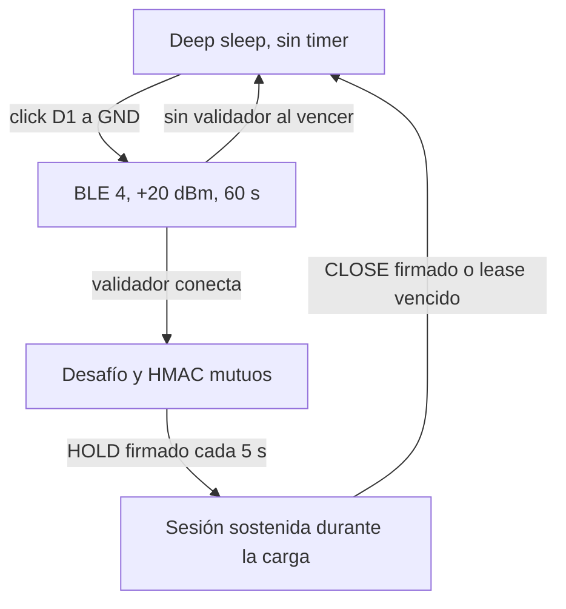

# Botón de despertar del MIM

## Cableado

El operador usa un pulsador momentáneo normalmente abierto entre D1/GPIO3 y
GND. No se aplica tensión al pulsador.

```text
                         XIAO ESP32-C3

                         D1 / GPIO3 o─────────┐
                                             │
                                      ┌──────┴──────┐
                                      │  pulsador   │
                                      └──────┬──────┘
                                             │
                              GND o──────────┘

Producción:

                     3V3 o──[47–100 kΩ]──o D1 / GPIO3
                                           │
                                      pulsador
                                           │
                                          GND
```

En un pulsador de cuatro patas se usa un contacto de cada lado; dos esquinas
diagonales son una elección segura. Sin presionar debe haber circuito abierto y
al presionar, continuidad. El botón nunca se conecta a BAT+, 5 V ni directamente
a 3V3.

## Política 0.6.2



- El debounce es de 40 ms.
- Una pulsación sostenida durante 20 segundos limpia la asignación tanto desde
  un arranque en frío como al despertar desde deep sleep. El firmware espera
  que se libere el botón y reinicia cargando el estado limpio. Durante el hold
  alimenta explícitamente el watchdog de 15 segundos.
- Una pulsación breve al despertar conserva la ventana operacional normal y no
  abre mantenimiento.
- La ventana operacional dura exactamente 60 segundos desde que inicia BLE.
- Pulsaciones adicionales no reinician ni extienden esa ventana. Si una coincide
  con su vencimiento, el MIM espera la liberación antes de dormir y vuelve a
  armar correctamente el wake por botón.
- El hold de 20 segundos se evalúa únicamente en el primer gesto que provoca el
  arranque o wake. Una vez iniciada la ventana BLE, cualquier pulsación o hold
  adicional se ignora hasta que el MIM vuelva a deep sleep.
- No existen despertares autónomos de diagnóstico.
- Un MIM recién enrolado reinicia y duerme sin anunciar.
- Un arranque en frío de un MIM enrolado duerme sin anunciar, salvo la prueba
  excepcional de 5 segundos de una OTA pendiente.
- Si el botón queda pegado en LOW al dormir, el wake se omite para evitar un
  bucle. Se recupera liberándolo y reiniciando o ciclando energía.

## Aceptación

1. Verificar continuidad sólo durante la pulsación y ausencia de corto a BAT+,
   3V3 o 5 V.
2. Con el MIM enrolado, confirmar que no anuncia después de un arranque normal.
3. Iniciar un escaneo y hacer un click: `Fuel-XXXXXX` debe aparecer.
4. Medir una ventana sin conexión: debe mantenerse 60 s y luego desaparecer.
5. Completar autenticación BLE 4, mantener la concesión durante la carga y
   confirmar sueño inmediato tras `CLOSE`.
6. Repetir autenticación completa a 5 m y 10 m con línea de vista y montaje
   definitivo.

La prueba eléctrica y de consumo está en
[`mim-battery-acceptance.md`](mim-battery-acceptance.md).
